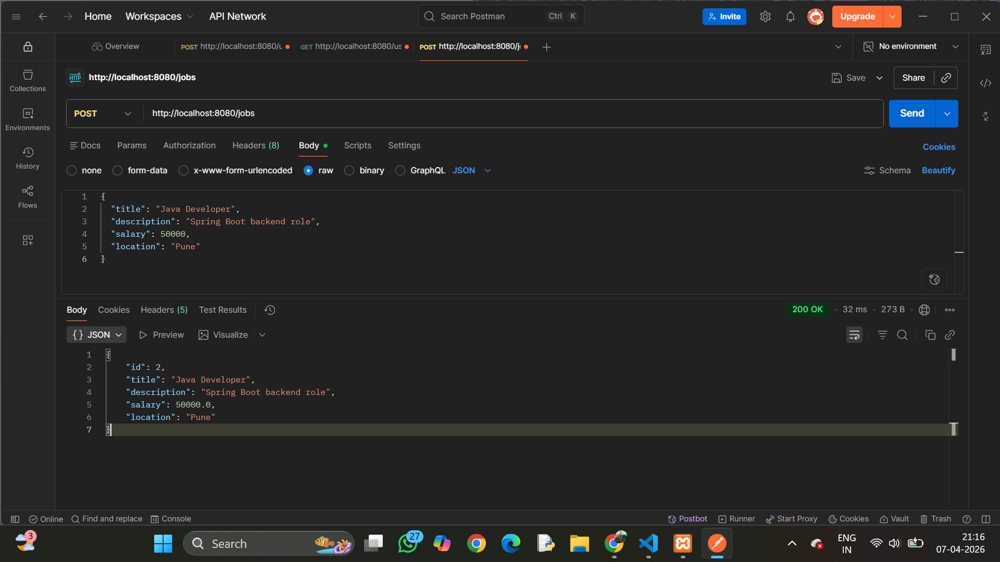
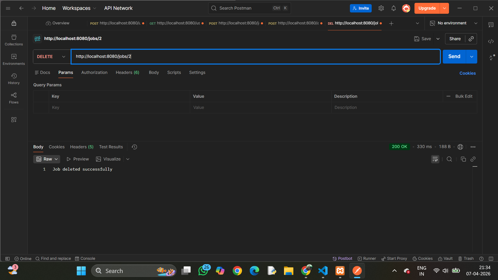
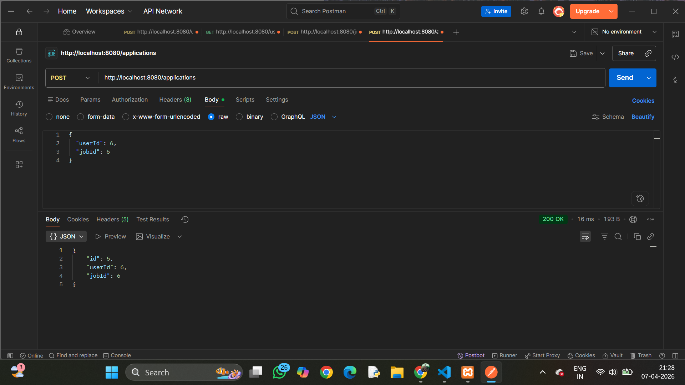
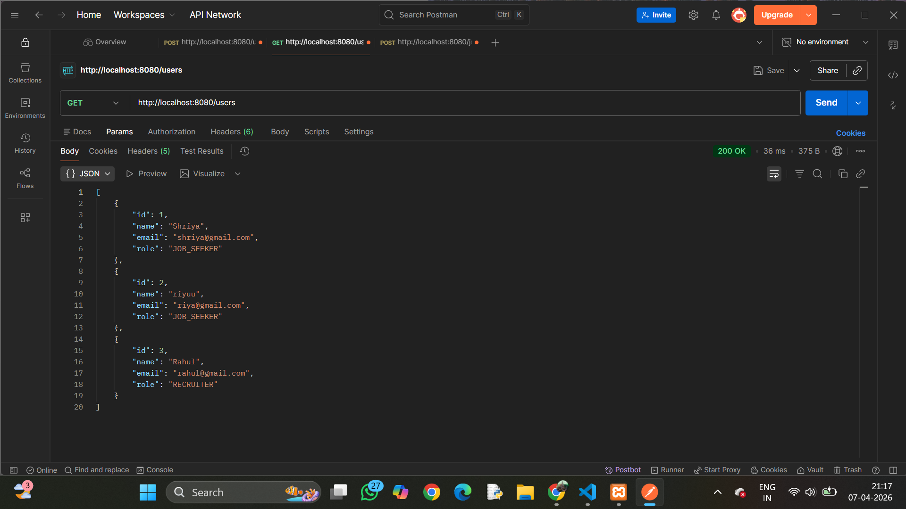
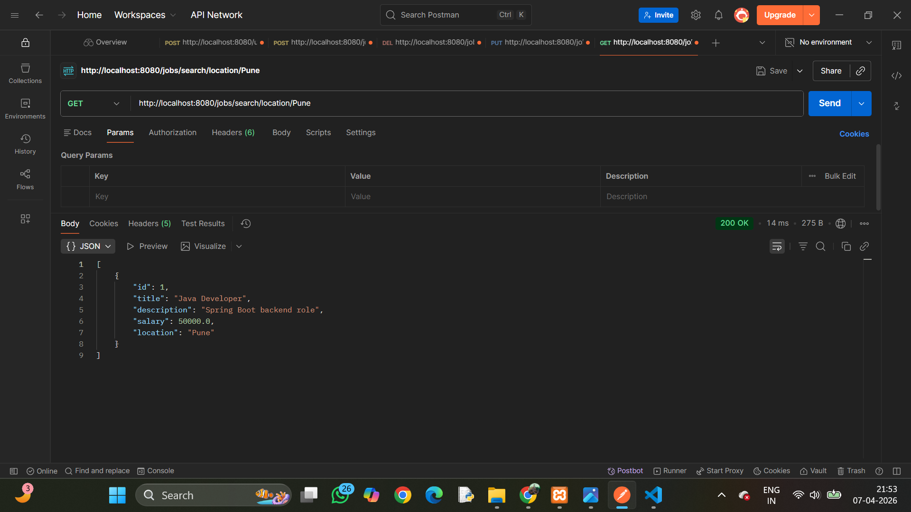

# 🚀 Job Portal Backend (Spring Boot)

A RESTful backend application for a Job Portal system built using Spring Boot.  
It allows users to register, login, post jobs, search jobs, and apply for jobs.

---
## 🛠 Tech Stack

- Java
- Spring Boot
- Spring Data JPA
- MySQL
- Maven

---
## 🚀 Features

### 👤 User Module
- User Registration
- User Login

### 💼 Job Module
- Create Job
- Update Job
- Delete Job
- Get All Jobs

### 🔍 Search Feature
- Search jobs by title
- Search jobs by location

### 📥 Application Module
- Apply to Job
- View Applications by User
- View Applicants by Job

---

## 📸 API Screenshots

### Create Job

### Update Job

### Delete Job

### Apply Job

### View Applications

### Search Job

---

## 📌 API Endpoints

| Method | Endpoint | Description |
|------|--------|------------|
| POST | /users | Register user |
| POST | /users/login | Login user |
| POST | /jobs | Create job |
| GET | /jobs | Get all jobs |
| PUT | /jobs/{id} | Update job |
| DELETE | /jobs/{id} | Delete job |
| GET | /jobs/search/location/{location} | Search by location |
| POST | /applications | Apply to job |
| GET | /applications/user/{userId} | Get user applications |
| GET | /applications/job/{jobId} | Get job applicants |

## 👩‍💻 Author

**Shriya Sawant**
